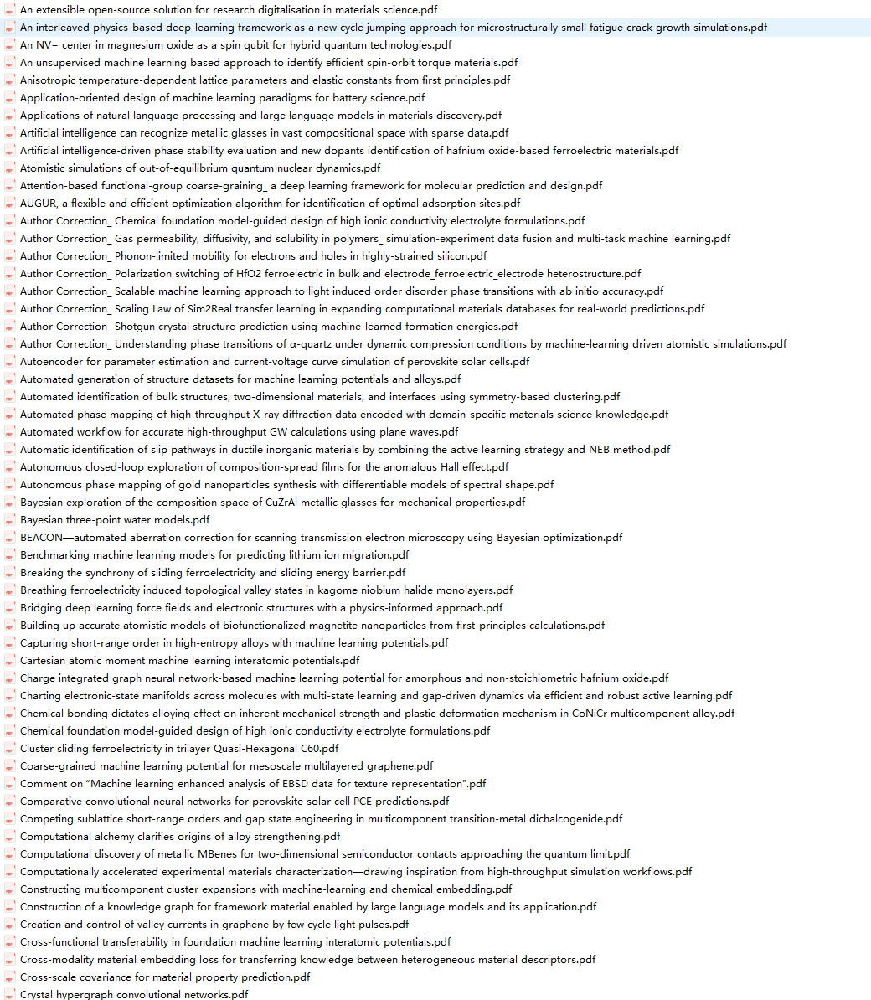
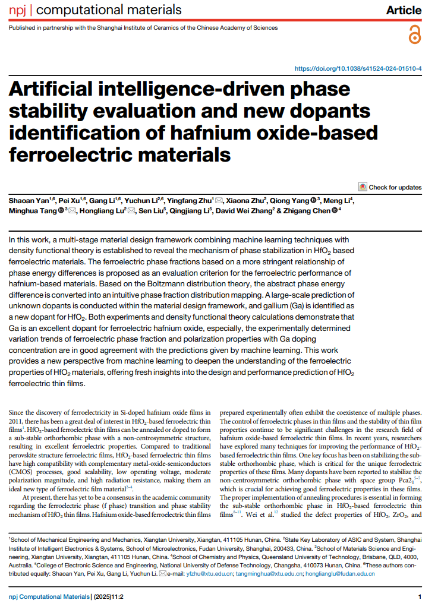
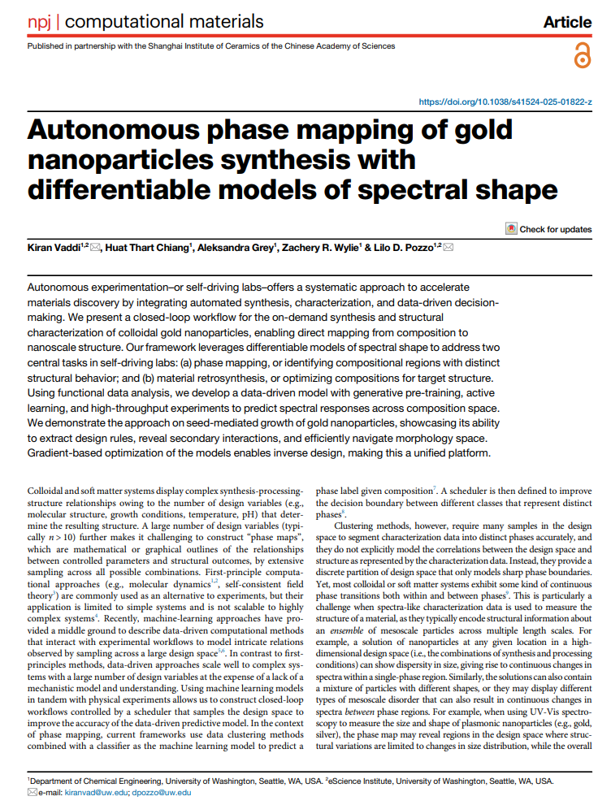
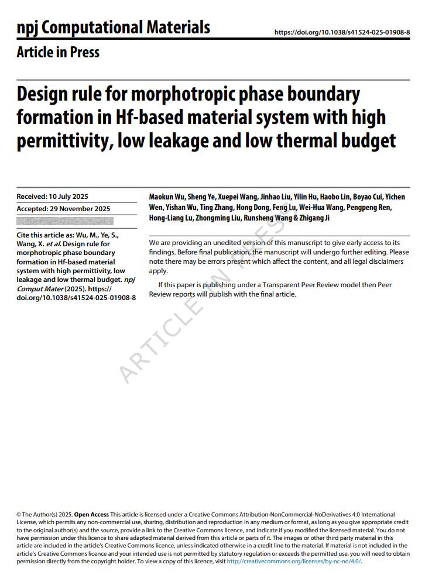

## Body

NPJ Computational Materials is a collection of 392 articles from 2025, published in the journal Nature.

Full Name: Natural Partnership Journal Computational Materials
Abbreviation: NPJ Computational Materials

Brief Description
Hosted by the Shanghai Institute of Silica Research of the Chinese Academy of Sciences and Springer Nature (Nature Group), it is jointly established.
Positioning: A top-tier journal in TOP SCI under Nature.

## Images

item_1057308617526

Here is a pay link on Stripe ( https://buy.stripe.com/3cs8yP7sY87d0vu9AB ). Please contact me lonlonago@foxmail.com after funding $89, and I will send you a complete data files , thank you!

